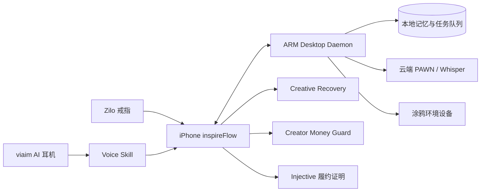

# inspireFlow 多赛道扩展与适配方案

> 目标：在不拆散 inspireFlow 产品主线的前提下，同时申报 02、06、10、15、21、22 六条赛道。
>
> 本文只分析赛道要求、产品适配和实现边界，不回答各赛道的提交问答。

## 1. 总体策略

不要为六条赛道制作六个互不相关的 Demo。统一把 inspireFlow 定义为：

> 一个为创作者守住灵感、状态与履约上下文的环境型 Agent。戒指和耳机负责低打扰输入，iPhone 负责编排，桌面主机保管长期上下文，环境设备表达状态，AI 在需要时推进创造，也在过载时帮助用户安心离场。

现有主流程保持不变：

```text
灵感捕获
  -> Whisper 转写
  -> PAWN 三轮澄清
  -> 项目与内容方案
  -> 品牌协作
  -> Injective 履约证明
```

在此基础上增加五个可复用模块：

1. **Voice Skill**：统一耳机、手机麦克风和戒指触发的语音会话，支持语音输入、三轮对话和语音播报。
2. **Creative Recovery**：捕获未完成念头、生成低压力返回点、开启休息计时并暂停干扰。
3. **Desktop Daemon**：在 ARM 桌面主机上常驻，保存私有记忆、运行任务调度、提供局域网 API 和离线队列。
4. **Ambient Companion**：通过涂鸦 T5 像素屏或 TuyaOpen 设备显示捕获、专注、恢复和任务状态。
5. **Creator Money Guard**：面向收入不稳定创作者的项目现金流解释、资金分桶、风险提示和人工确认护栏。

它们不是五个孤立功能，而是同一条跨设备链路：



## 2. 赛道覆盖总览

| 编号 | 赛道 | 适配方式 | 必须满足的硬门槛 | 主要新增模块 | 当前可申报程度 |
| --- | --- | --- | --- | --- | --- |
| 02 | Desktop Daemon | 创作者上下文守护主机 | 服务和数据真实运行在赛道主机，体现 ARM 常驻能力 | Desktop Daemon | 拿到主机并部署后可完整申报 |
| 06 | Amazon Quick / Kiro | 用 Kiro 规格驱动完成新增模块 | 必须真实使用 Quick 或 Kiro | Kiro 规格、实现与测试证据 | 使用 Kiro 完成一次开发闭环后可申报 |
| 10 | Hack the Rest | 创作认知卸载与安心离场 | 作品必须真实帮助休息或恢复 | Creative Recovery | 补完整恢复闭环后可申报 |
| 15 | Money Whisperer | 创作者不稳定收入与项目现金流管家 | 理财逻辑、风险管理、合规提示和完整闭环 | Creator Money Guard | 需要新增真实财务模块，不能只复用链上付款 |
| 21 | 涂鸦智能 | 无屏/低打扰的创作与恢复环境 | 必须使用至少一种指定涂鸦工具或平台 | Ambient Companion | 拿到设备或接入 TuyaOpen 后可申报 |
| 22 | viaim 耳机 Skill | 耳边创作 Agent | 必须使用 viaim SDK，核心流程 Voice First | Voice Skill | 接 SDK 和语音播报后高度匹配 |

## 3. 统一 Demo 主线

六个赛道可以使用同一段故事，仅在不同赛道突出不同部分：

1. 创作者工作时突然想到一个内容创意，用戒指或 viaim 耳机唤醒 inspireFlow。
2. 用户全程语音表达，PAWN 用三轮短问题澄清对象、形式和约束。
3. 原始音频、项目上下文和待办先进入桌面主机的本地队列；需要大模型时再调用云端。
4. T5 像素屏显示“灵感已接住”，用户不必打开手机确认。
5. AI 生成创作方案和唯一的下一步行动。
6. 用户感到过载时说“我先停一下”，系统保存当前上下文并进入恢复模式。
7. 恢复结束后，系统只提醒一个低压力返回点，不把完整任务列表重新压给用户。
8. 商业项目完成后，品牌预算、交付摘要和 Injective 履约状态进入 Creator Money Guard，给出现金流分桶建议和风险说明，最终决策仍由用户确认。

这条主线让各赛道看到真实技术接入，同时保持 inspireFlow 仍然是一个创作者产品，而不是临时拼装的赛道合集。

## 4. 02 Desktop Daemon

### 4.1 擦边定位

把 inspireFlow 从“手机里的创作 App”扩展为“住在桌上的创作上下文守护者”。它不替用户持续产出，而是 24 小时守住灵感、未完成状态、文件变化和后台任务，让用户离开后仍能安全续接。

### 4.2 现有能力复用

- 项目、灵感和 PAWN 对话已经有明确数据模型。
- iPhone 与智能戒指已经形成硬件输入入口。
- Whisper、PAWN 和 Injective 已有远程调用链路。
- 本地缓存和远程同步已有初步实现。

### 4.3 最小真实实现

在赛道提供的 ARM 主机上运行一个常驻服务：

- SQLite 保存灵感、项目摘要、设备事件和后台任务。
- 本地文件目录保存原始音频；默认不上传原始音频。
- FastAPI 或其他轻量服务提供局域网 API。
- Bonjour/mDNS 让 iPhone 自动发现主机。
- 调度器执行“每日项目摘要”“未整理灵感归档”“失败任务重试”。
- 离线时接受灵感并排队，联网后再调用 PAWN 或 Whisper。
- 提供健康状态、最近同步时间和队列数量。
- 至少实测一次重启自恢复和断网续传。

### 4.4 本地与云端边界

| 留在桌面主机 | 调用云端 |
| --- | --- |
| 原始音频、长期记忆、项目索引、任务计划、隐私规则、同步队列 | 高质量 Whisper、PAWN 大模型、品牌共享接口、Injective 网络 |

本地优先的理由是隐私、离线连续性和长期所有权；云端负责 ARM 主机不适合承担的重推理以及必须跨用户共享的能力。

### 4.5 不可虚构的部分

- 不能把当前公网后端称为桌面本地服务。
- 不能只有架构图，必须在赛道机器上运行并能从 iPhone 访问。
- 若没有部署本地模型，可以诚实说明采用本地规则、索引与调度，重推理走云端。
- 必须准备 CPU、内存、磁盘和空闲功耗等基本实测数据，证明考虑过 ARM 低功耗环境。

## 5. 06 Amazon Quick / Kiro

### 5.1 擦边定位

选择 Kiro，而不是勉强把 Amazon Quick 塞进产品运行链路。使用 Kiro 对 Creative Recovery 或 Desktop Daemon 做一次完整的规格驱动开发，赛道作品仍然是 inspireFlow，但新增能力由 Kiro 快速完成。

### 5.2 最小真实实现

- 使用 Kiro 创建正式 spec，而不只是聊天生成几段代码。
- 在 spec 中包含需求、非目标、用户故事和验收条件。
- 由 Kiro 生成设计文档和任务拆分。
- 用 Kiro 实现至少一个完整模块及对应测试。
- 保存 Kiro 产物到仓库，例如 `.kiro/specs/creative-recovery/`。
- 记录开始时间、完成时间、人工修改点和测试结果。
- 准备从自然语言需求到运行中功能的连续录屏。

### 5.3 推荐让 Kiro 实现的内容

首选 Creative Recovery，因为范围清晰且可在 iOS 内独立验收：

- 恢复会话状态机。
- 10/20/30 分钟计时。
- 暂停、提前结束和完成状态。
- 中断前上下文保存。
- 返回时只显示一个下一步。
- 本地持久化和单元测试。

备选是 Desktop Daemon 的离线任务队列和 API 契约。

### 5.4 不可虚构的部分

- 使用其他 AI 编程工具完成现有项目，不能算使用 Kiro。
- 仅在文档中提到 Kiro 不够，仓库和录屏应留下可验证产物。
- 不要声称整个项目都由 Kiro 一次生成；突出一个高质量、可测量的快速闭环更可信。

## 6. 10 Hack the Rest

### 6.1 擦边定位

inspireFlow 不把“休息”理解为再做一项效率任务，而是替创作者接住未完成念头，降低“现在停下就会忘记”的焦虑。核心价值是认知卸载、安心离场和低压力恢复。

### 6.2 Creative Recovery 最小闭环

1. 用户通过语音、戒指或按钮说“我需要停一下”。
2. 系统询问当前最担心忘记什么，只允许一次简短回答。
3. PAWN 把当前状态压缩为：已完成、未完成、回来后第一步。
4. 用户确认后进入 10/20/30 分钟恢复计时。
5. 恢复期间暂停普通项目推进提醒，可选播放呼吸节奏或环境音。
6. 涂鸦屏或 iPhone 仅展示安静的剩余时间，不展示任务堆积。
7. 结束后询问用户是否恢复，不强迫立即工作。
8. 用户选择返回时，只呈现之前保存的一个下一步。

### 6.3 可加入的真实指标

- 休息前和休息后的主观精力，使用简单的 1 至 5 自评。
- 成功离开工作界面的次数。
- 中途打开项目或取消休息的次数。
- 从休息结束到重新开始第一步的时间。

这些指标只用于产品反馈，不作医疗或心理诊断。

### 6.4 不可虚构的部分

- 不宣称治疗失眠、焦虑或职业倦怠。
- 仅增加番茄钟不足以体现“重新创造休息”。认知卸载和低压力返回才是差异点。
- 不应在休息结束后用积分、连续打卡或催促文案重新制造压力。

## 7. 15 Money Whisperer

### 7.1 擦边定位

这一赛道不能把 Injective 链上履约直接叫作理财。最接近 inspireFlow 主线、又能形成真实产品的是：

> 面向自由职业创作者和独立内容创作者的 AI 现金流护栏，把分散的项目收入、待回款、税费预留和生活安全垫统一解释，帮助理财小白建立长期、保守的资金习惯。

目标用户必须限定为“收入波动大、按项目收款、缺少财务知识的个人创作者”，而不是所有投资者。

### 7.2 最小真实闭环

- 手动录入现金、存款、低风险理财、基金等资产余额。
- 导入或读取 inspireFlow 中商业项目的预算、托管、待交付和已结算状态。
- 记录每月必要支出、税费预留目标、短期目标和风险承受等级。
- 先通过确定性规则计算现金流，再由 AI 用普通语言解释。
- 输出“生活安全垫、税费预留、项目运营、长期资金”四个资金桶。
- 展示建议依据、数据更新时间、缺失数据和不确定性。
- 高风险、数据冲突或现金流不足时停止生成投资倾向建议，只给出风险提示。
- 所有移动资金或投资操作必须由用户确认；Demo 不实际代客交易。

### 7.3 建议生成逻辑

建议采用“规则引擎先行，AI 负责解释”的结构：

```text
资产和项目数据
  -> 完整性检查
  -> 收支与收入波动计算
  -> 应急资金和短期负债规则
  -> 风险承受能力约束
  -> 候选资金分桶
  -> AI 生成易懂解释
  -> 合规与异常规则复核
  -> 用户确认或寻求人工帮助
```

第一版可使用以下保守规则，但必须标注为演示规则并允许专家复核：

- 先覆盖近期必要支出和已知负债，再讨论长期配置。
- 收入越不稳定，应急资金月数越高。
- 近期要使用的资金不进入高波动资产建议。
- 用户数据不完整时不输出精确比例。
- 不预测收益、不承诺保本、不根据聊天情绪鼓励交易。

### 7.4 AI Native 体现

- 用户可用语音说“刚收到一个品牌尾款”，系统结合项目履约状态更新现金流。
- AI 主动解释“为什么现在不建议增加风险”，不是只展示资产图表。
- 对不确定收入生成情景分析，例如延迟回款 30 天后的安全垫变化。
- PAWN 追问缺失信息，每轮只问一个最关键问题。
- 将复杂的风险和现金流概念翻译成理财小白能理解的行动。

### 7.5 合规红线

- 明确声明产品提供财务教育和辅助分析，不构成投资建议。
- 不推荐具体证券、基金、币种或买卖时点。
- 不承诺收益、保本或风险消失。
- 不把 Injective 测试网资产或商业托管金额算作用户可自由支配资产。
- 不在信息不完整时生成看似精确的配置比例。
- 高风险异常应建议暂停操作，并寻求持牌专业人士帮助。

### 7.6 最低演示数据

至少准备三类用户场景：

- 刚开始接单、现金少但近期支出稳定的新手创作者。
- 多个平台和多个项目分散回款的全职创作者。
- 有一笔大额待结算、但税费和应急资金不足的创作者。

每个场景都必须展示不同判断，不能用同一段 AI 文案替换数字。

## 8. 21 涂鸦智能

### 8.1 擦边定位

将涂鸦设备定义为“创作环境的低打扰输出与主动响应层”。AI 不只住在手机聊天框，而是通过环境状态帮助用户知道灵感是否保存、现在应专注还是休息，以及返回时应从哪里继续。

### 8.2 最低硬件路线

优先选择 T5 像素屏；它最容易与现有 App 和其他赛道形成统一体验：

- 捕获时显示简短动画和“已接住”。
- PAWN 处理时显示状态，不要求用户盯手机。
- 专注时显示当前唯一行动。
- 恢复时显示低刺激倒计时。
- 桌面主机离线时显示本地保存状态。
- 商业项目到账或履约完成时显示不包含敏感金额的状态提示。

如果没有 T5 像素屏，则使用 TuyaOpen 或智能 Zigbee 网关连接灯光/提示设备，但仍须提供真实设备控制证据。

### 8.3 技术接入

- Desktop Daemon 或 iPhone 将业务状态映射为有限状态：`idle`、`capturing`、`thinking`、`focus`、`resting`、`offline`。
- 通过涂鸦提供的平台或协议向设备发送状态，不在设备上复制完整私有内容。
- 设备事件可以触发开始休息、确认捕获或切换勿扰，但保留 App 作为完整控制端。
- 断网时回退到本地最近状态，恢复网络后同步。

### 8.4 不可虚构的部分

- Zilo 戒指不属于涂鸦生态，不能替代指定工具。
- 必须列出真实使用的 T5 开发板、T5 像素屏、Zigbee 网关或 TuyaOpen。
- 只展示静态屏幕设计不算接入；至少要有一次由 inspireFlow 状态驱动的真实设备变化。
- 不在公共像素屏显示灵感原文、联系方式、预算或其他敏感信息。

## 9. 22 viaim 耳机 Skill

### 9.1 擦边定位

把现有录音、Whisper 和 PAWN 三问包装成真正的耳边 Skill：用户从唤醒到保存灵感都不需要频繁看手机，AI 用短语音逐步把模糊念头变成可执行方案。

### 9.2 最小真实实现

- 接入 viaim AI 耳机语音交互 SDK。
- SDK 唤醒或耳机操作进入 Voice Skill，而不是只打开普通录音页。
- 语音输入进入现有 Whisper/PAWN 链路。
- 每次 PAWN 只提出一个问题，并通过耳机播报。
- 至少完成三轮对话、确认和结束播报。
- 支持“重复”“取消”“保存后停止”语音命令。
- 手机只作为可选的状态镜像和错误恢复入口。
- 记录当前音频路由，断开耳机时给出明确回退，不伪造耳机能力或电量。

### 9.3 建议的语音状态机

```text
idle
  -> listeningIdea
  -> askingQuestion1
  -> listeningAnswer1
  -> askingQuestion2
  -> listeningAnswer2
  -> askingQuestion3
  -> listeningAnswer3
  -> confirming
  -> generating
  -> speakingSummary
  -> saved / cancelled / recoverableError
```

### 9.4 与现有戒指的关系

- 耳机负责私密语音输入与输出。
- 戒指负责不说话时的唤醒、确认、取消或暂停。
- iPhone 负责编排和完整视觉内容。
- Desktop Daemon 负责本地长期记忆与后台任务。

四者职责互补，避免把多个硬件描述成重复入口。

### 9.5 不可虚构的部分

- 普通 iPhone 麦克风录音不能宣称为 viaim SDK 接入。
- 仅有语音输入不够，核心链路还需语音输出和多轮交互。
- 允许模拟器或 Web Demo 不等于可以跳过 SDK；应保留真实 SDK 调用或官方允许的模拟方式。

## 10. 共享开发计划

### P0：先满足所有硬门槛

- [ ] 获取 viaim SDK、接入文档和可用设备或官方模拟环境。
- [ ] 获取清闲智能 ARM 主机并确认系统、架构、网络和部署权限。
- [ ] 获取至少一种涂鸦指定设备或 TuyaOpen 开发条件。
- [ ] 安装并真实使用 Kiro，选择一个模块完成 spec 到测试闭环。
- [ ] 为 Money Guard 确定演示规则、合规文案和三组结构化数据。

### P1：实现共享产品模块

- [ ] 抽取统一 `VoiceSkillSession`，复用现有录音、Whisper 和 PAWN 能力。
- [ ] 增加语音播报、重复、取消、超时和耳机断开恢复。
- [ ] 实现 Creative Recovery 状态机、计时、本地持久化和低压力返回点。
- [ ] 实现 Desktop Daemon 的 SQLite、局域网 API、任务调度和离线队列。
- [ ] 让 iPhone 自动发现并显示 Desktop Daemon 的在线、同步和队列状态。
- [ ] 实现涂鸦设备的状态映射和至少一个真实控制动作。
- [ ] 实现 Creator Money Guard 的资产输入、现金流规则、情景分析和风险护栏。

### P2：联调与证据

- [ ] 用 viaim 完成一次三轮全语音灵感捕获。
- [ ] 主机断网时保存一条灵感，联网后成功补处理。
- [ ] 重启 ARM 主机，验证 daemon 自动恢复且数据仍在。
- [ ] inspireFlow 状态变化真实驱动一次涂鸦设备变化。
- [ ] Creative Recovery 完成一次安心离场和低压力返回。
- [ ] Money Guard 对三组演示数据输出不同且可解释的结果。
- [ ] 保存 Kiro spec、任务、代码变更和测试结果。
- [ ] 对所有云端失败路径提供可见错误和不虚构成功的 Demo fallback。

## 11. 推荐实施顺序

1. **Creative Recovery**：范围最小，可先覆盖蓝盒子，并作为 Kiro 的规格驱动开发对象。
2. **Voice Skill 抽象**：复用现有链路，随后接 viaim SDK。
3. **Desktop Daemon**：为本地所有权、离线能力和涂鸦设备提供统一中枢。
4. **Ambient Companion**：拿到涂鸦设备后连接 daemon 状态。
5. **Creator Money Guard**：单独完成规则和合规审查，避免 AI 自由生成理财结论。
6. **端到端联调**：把五个增量模块串成一段稳定演示。

这个顺序的关键是复用：Creative Recovery 同时服务 06 和 10；Voice Skill 同时强化 10 和 22；Desktop Daemon 同时服务 02 和 21；商业履约数据同时为 15 提供真实但受限的收入来源。

## 12. 申报边界与风险表

| 风险 | 现场可能被追问 | 应对原则 |
| --- | --- | --- |
| 六赛道像临时拼装 | 为什么一个产品什么都做？ | 始终围绕“守住创作者的灵感、状态和履约上下文”，展示同一主线中的不同设备层和服务层 |
| Desktop Daemon 仍依赖云 | 为什么叫本地 Agent？ | 展示断网捕获、SQLite 数据、任务队列和本地检索；明确重推理为何使用云端 |
| viaim 只是普通录音 | SDK 用在哪里？ | 现场展示 SDK 事件、音频路由和完整三轮耳机交互 |
| 涂鸦只是装饰屏 | AI 和设备有什么关系？ | 让业务状态真实驱动设备，并支持一个设备事件反向触发行为 |
| 休息功能变成效率工具 | 用户是否被进一步催促？ | 展示认知卸载、暂停提醒和自主结束，不用打卡、排行或强制返回 |
| Money Guard 不专业 | 建议依据和异常机制是什么？ | 展示确定性规则、数据缺口、风险提示、情景分析和人工确认，AI 只负责解释 |
| Kiro 使用证据不足 | 是否只是最后打开过 Kiro？ | 保留 spec、任务、提交差异、测试和连续录屏 |
| Demo 数据被说成真实云同步 | 哪些数据真实持久化？ | 对本地、主机、云端和链上数据分别标注，不把本地 fixture 当生产结果 |

## 13. 最终验收标准

六条赛道全部申报前，至少应达到：

- 02：ARM 主机上有可重启、可离线、可从 iPhone 访问的真实 daemon。
- 06：仓库中存在 Kiro 规格产物，并有一个由其完成且通过测试的模块。
- 10：用户可完整执行“卸载念头 -> 休息 -> 低压力返回”。
- 15：三组创作者财务场景经过规则计算，建议有依据、限制和合规提示。
- 21：至少一种指定涂鸦工具被真实控制，且与业务状态联动。
- 22：通过 viaim SDK 完成至少三轮 Voice First 交互。

未达到某条硬门槛时，可以继续开发，但不应在申报材料中把规划描述成已实现。六赛道策略的重点不是模糊要求，而是用最少的共享实现，分别提供每条赛道都能现场验证的真实证据。