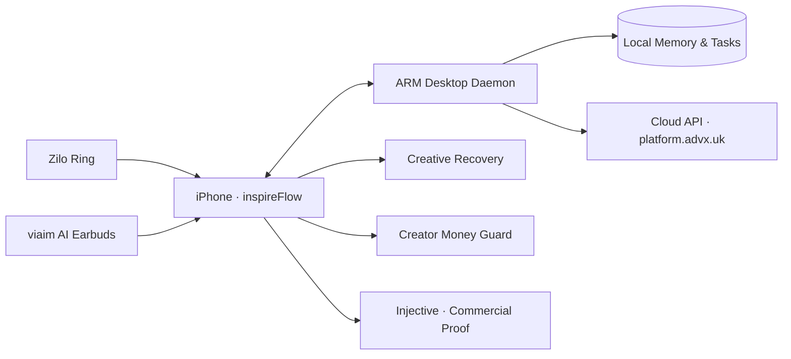

<p align="center">
  <picture>
    <source media="(prefers-color-scheme: dark)" srcset="icon.png">
    
  </picture>
</p>

<h1 align="center">inspireFlow</h1>

<p align="center">
  <em>Capture ideas without breaking the moment. Develop them with PAWN.<br>
  Carry creative work from inspiration to delivery.</em>
</p>

<p align="center">
  <a href="#product">Product</a> ·
  <a href="#flow">Flow</a> ·
  <a href="#hardware">Hardware</a> ·
  <a href="#architecture">Architecture</a> ·
  <a href="#tracks">Tracks</a>
</p>

---

## Product

inspireFlow is an ambient creative agent that lives at the intersection of **voice-first capture**, **AI collaboration**, and **verifiable commercial delivery**. It does not push creators to produce more. Instead, it lowers the cost of catching an idea, keeps creative context alive across devices and sessions, and steps in when the creator needs to rest.

The product is purpose-built for the **AdventureX 2026 Hackathon** and spans six competition tracks under a single coherent experience.

### What it solves

| Problem | How inspireFlow answers |
|---|---|
| Inspiration captured too late | Ring double-tap or voice command captures instantly, hands-free |
| Vague ideas never become action | PAWN asks exactly three clarifying questions, then generates a structured production pack |
| Creative context gets fragmented | Cloud syncs project state; Desktop Daemon keeps your private backlog safe |
| Creators can't step away | Creative Recovery saves your unfinished thought and returns only one next step |
| Brand collaborations lack trust | Injective chain records commitment, submission, authorization, and settlement |
| Freelance cash flow is opaque | Money Guard separates restricted from available funds and explains in plain language |

---

## Flow

```text
Ring or viaim headset
  → Voice capture & Whisper transcription
  → PAWN: 3 clarifying questions
  → Bilibili production pack (title, hook, outline, shot list)
  → Project organization & mind-map
  → Teleprompter & export
  → Brand collaboration & Injective commercial proof
  → Creative Recovery when the creator needs a break
  → Money Guard for project-based cash flow insight
```

All of this can happen **without touching the screen** when a viaim headset is connected.

---

## Hardware

| Device | Role | Status |
|---|---|---|
| **Zilo smart ring** | BLE-connected. Double-tap triggers global capture. Single-click controls recording. | ✅ Integrated |
| **viaim AI earbuds** | Real-time text stream during live recording. PAWN questions spoken through AVSpeechSynthesizer. | ✅ Integrated (requires physical device) |
| **iPhone** | Primary orchestrator. Works fully without any peripheral. | ✅ Primary target |

---

## Architecture



### Data boundaries

| Layer | Stores |
|---|---|
| iPhone | Current interaction, encrypted cache, pending sync |
| Desktop Daemon | Raw audio, long-term memory, local index, offline queue |
| Cloud | Account, shared projects, inspirations, PAWN state, brand collaboration, chain facts |
| On-chain | Commercial task digest, artifact SHA-256, amount, authorization, settlement |

Raw audio, full transcripts, scripts, contacts, and tokens never touch the chain.

---

## Backend

The production backend runs at **`https://platform.advx.uk/api/v1`** (FastAPI, 76 endpoints, 17 route groups).

| Module | Capabilities |
|---|---|
| **Auth** | Register, login, session management, Keychain-backed token |
| **Profile** | Creator profile read/write with field-level visibility |
| **Projects** | CRUD, AI draft from description, project-scoped inspirations |
| **Inspirations** | Full lifecycle (inbox → developing → converted → archived), multi-project links, keyword search |
| **Conversations** | Persistent Agent sessions, request/response & SSE streaming, encrypted history, long-term memory |
| **Transcription** | Async Replicate Whisper (`vaibhavs10/incredibly-fast-whisper`) via Hack Club AI proxy |
| **Workshops** | Draft → publish → withdraw, field-level visibility, contacts, social accounts, brand authorization |
| **Brand Engagement** | Brand CRUD, member roles, invitations, creator discovery, follows, interests, inbox |
| **Brand Advisory** | AI-generated market research reports with evidence tracking and recommendations |
| **Commercial Tasks** | Injective-backed lifecycle: create → submit → authorize → settle, chain proof with explorer URLs |
| **Idempotency** | Every authenticated write requires `Idempotency-Key`; server deduplicates by user + path + key |

---

## Tracks

inspireFlow is submitted to all six AdventureX 2026 tracks through a shared product core:

| # | Track | How inspireFlow fits |
|---|---:|---|
| **02** | Desktop Daemon | ARM host keeps your creative context alive 24/7 — local queue, offline capture, Bonjour discovery |
| **06** | Amazon Quick / Kiro | Creative Recovery module built through Kiro spec-driven development |
| **10** | Hack the Rest | Creative Recovery: cognitive offload → rest timer → low-pressure return, not another pomodoro |
| **15** | Money Whisperer | Creator Money Guard: project income, tax reserve, safety buffer — rules first, AI explains |
| **21** | 涂鸦智能 | Ambient Companion: T5 pixel screen shows capture/focus/rest status without breaking the moment |
| **22** | viaim 耳机 Skill | Voice-first inspiration agent: capture, clarify, and confirm — all through the earbuds |

---

## Repository

```
inspireFlow（升变）/          → SwiftUI application
inspireFlow（升变）/RingSound/ → Native smart-ring BLE transport
inspireFlow（升变）/RingSDK/    → Python reference SDK & protocol docs
log/                          → Decision records
HACKATHON-TRACK-EXPANSION.md  → Multi-track strategy
BACKEND-NEXT-PHASE.md         → Backend roadmap
FRONTEND-NEXT-PHASE.md        → Frontend roadmap
INSPIREFLOW-FINAL-SCOPE.md    → Complete feature & purpose inventory
```

---

<p align="center">
  <sub>Built for <a href="https://adventurex2026.dev">AdventureX 2026</a> · <code>adventurex2026</code></sub>
</p>
